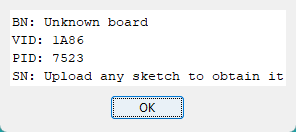
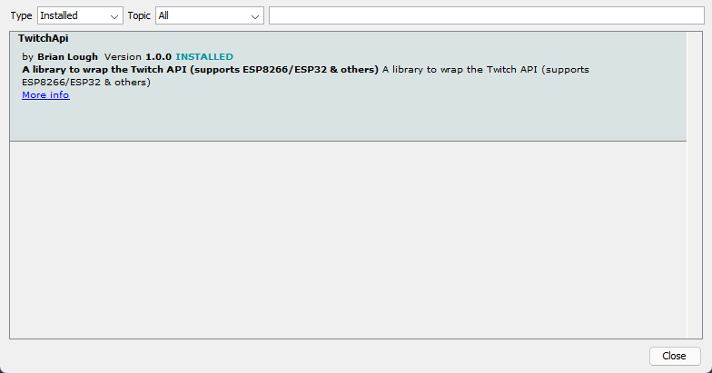
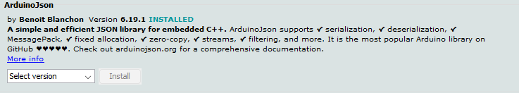
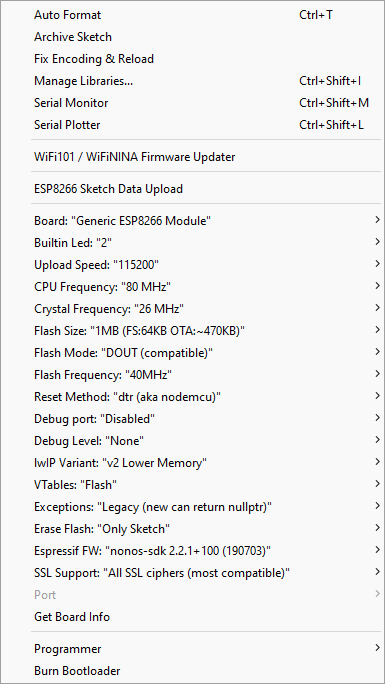

# Arduino Twitch Live LED

This was coded for an ESP8266 board.

Online LED must be connected to D1 (GPIO 5)
Offline LED must be connected on to (GPIO 4)
Optional : Activity LED can be connected to D4 (GPIO 2)

Make sure you have the following libraries installed :

https://www.arduino.cc/reference/en/libraries/twitchapi/
https://arduinojson.org/v6/doc/installation/

Then, create a new application on https://dev.twitch.tv/ then go to https://twitchtokengenerator.comto generate your valid token

Update the Twitch credentials in the arduino file with yours.

Update the WiFi credentials in the arduino file with yours.

Update the channels tou want to monitor in the arduino file with yours.

